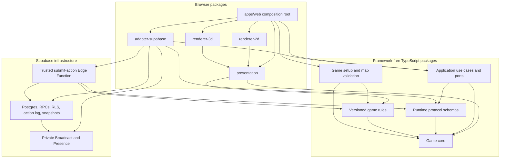

# TBS v2 System Design

Status: implemented; schema-v1 persisted compatibility intentionally retained

Last updated: 2026-08-11

Scope: the implemented incremental replacement architecture for the browser game

Implementation evidence and deliberate deferrals are recorded in [v2 implementation checkpoint](./v2-implementation-checkpoint.md). The supported production runtime remains defined by [architecture](./architecture.md).

## 1. Executive recommendation

Build TBS v2 as a TypeScript monorepo with four explicit architectural layers:

1. A deterministic, framework-free game core owns canonical state, commands, events, turn progression, and rule execution.
2. A game-rules package composes typed unit, ability, action, terrain, and mechanic modules into a versioned ruleset.
3. An application layer exposes use cases through provider-neutral ports. Supabase is the first backend adapter, not a dependency of the engine or React components.
4. A presentation layer converts game state and domain events into renderer-neutral view models and animation cues. Separate React renderers provide the existing 2D board and a new Three.js-based 3D board.

Use React with Vite for the browser app. Use React Three Fiber over Three.js for the 3D renderer, with an orthographic/isometric strategy camera, instanced terrain, glTF assets, and no physics engine for the MVP. Keep Supabase Postgres as the durable authority, Realtime Broadcast as a revision notification, Presence as ephemeral online state, and a TypeScript Edge Function as the trusted action executor.

Retain the monorepo because the browser, Edge Function, setup tools, engine, and tests must change atomically and share exact TypeScript contracts. Migrate from npm workspaces to pnpm workspaces for strict local-package linking and a single lockfile. Add Nx Core for the project graph, affected tasks, caching, and enforceable dependency boundaries. Do not adopt the full Nx plugin/generator ecosystem until its value is demonstrated.

This is an evolutionary migration. The current deterministic reducer, action/event history, revision reconciliation, Supabase RLS, private game channels, and adapter tests are valuable foundations. The goal is to extract and strengthen them rather than restart the product.

Repository implementation guardrails for this plan are codified in the root [AGENTS.md](../AGENTS.md).

## 2. Goals and non-goals

### Goals

- Keep TypeScript as the primary language in the browser, engine, shared packages, tests, and trusted action service.
- Keep React for the browser shell and UI.
- Make the same game rules run deterministically in the browser for previews and in a trusted backend boundary for authority.
- Make Supabase replaceable without leaking Supabase clients, row shapes, channels, or error types into application or domain code.
- Support both a 2D DOM renderer and a 3D renderer from the same canonical state and interaction model.
- Add units mostly by registering data and existing capabilities; add genuinely new abilities by adding one focused handler and its tests.
- Make rule ordering, protocol versions, state migrations, and content versions explicit and replayable.
- Scale build/test work by project dependency and scale runtime work by game session rather than global state.
- Prefer the smallest implementation that preserves the boundaries and quality standards in this document.

### Non-goals for the first v2 release

- Arbitrary third-party runtime mods.
- Real-time physics, collision simulation, or authoritative frame synchronization.
- Detailed character rigs, cinematic animation, particle-heavy combat, or complex shaders.
- Replacing Supabase before a measured limitation justifies it.
- Converting every folder into a separately published package.
- Rewriting all current behavior in one release.

## 3. Current-state assessment

The repository already contains several sound ideas:

- `common` is dependency-light and provides a deterministic `applyGameAction` reducer, versioned contracts, runtime parsing, and rule tests.
- `GameSessionGateway` and `SupabaseGameSessionGateway` establish an initial provider-neutral seam.
- Postgres stores durable snapshots and ordered actions. Realtime sends small revision notices, while clients recover from action history or a snapshot.
- RLS, membership checks, optimistic revisions, idempotent action IDs, private channels, bounded history, and multi-client Playwright coverage address important multiplayer failure modes.

The redesign should address these constraints:

- `applyGameAction` contains validation and execution for every action family, so it grows through branching and repeats movement, occupancy, object-consumption, revision, and event logic.
- Unit knowledge is spread across TypeScript unions, rule arrays, special-case functions, spawn/construction tables, ambient UI types, and an emoji table.
- A board cell contains terrain, occupancy, unit state, ownership, and transport state. That coupling makes entity movement and future stacking/status mechanics harder.
- UI interaction logic knows action-family details and builds engine commands directly.
- Emoji rendering and rule metadata can drift because presentation assets and unit behavior are not joined by one content identifier/manifest.
- The browser currently proposes the next state. Postgres validates session invariants, but a modified client can submit a cheating candidate state.
- Create React App and the existing test/tooling versions constrain modernization and the 3D integration path.

## 4. Target architecture



### Dependency direction

Dependencies always point inward. The game core must not import React, Three.js, Supabase, browser APIs, storage APIs, clocks, network clients, or presentation assets.

```text
apps/web
  -> application
  -> presentation
  -> renderer-2d | renderer-3d
  -> adapter-supabase

adapter-supabase -> application ports + protocol
renderer-*       -> presentation contracts
presentation     -> game-core + game-rules selectors
application      -> game-core + protocol
game-setup       -> game-core + game-rules
game-rules       -> game-core
protocol         -> game-core
game-core        -> no workspace package
```

Nx dependency constraints and ESLint import rules should fail CI when this direction is violated. Package public APIs must be exposed through explicit `exports`; consumers must not deep-import another package's internals.

## 5. Technology decisions

| Concern | Decision | Rationale |
| --- | --- | --- |
| Language | Current stable TypeScript, strict mode | Shared, precise contracts and one language across browser and Edge Functions. |
| Browser | React + Vite | Vite provides a modern React/TypeScript development and production pipeline. Run `tsc --noEmit` separately because Vite transpiles TypeScript but does not type-check it. |
| 3D | Three.js through React Three Fiber; Drei only for proven helpers | Three.js is the rendering foundation; React Three Fiber keeps scene composition aligned with React without putting game rules in scene components. |
| 3D assets | `.glb`/glTF 2.0, optionally Meshopt/KTX2 compression | glTF is designed for efficient runtime delivery and can include meshes, materials, rigs, and animation clips. |
| Animation | Renderer-neutral cue scheduler; `useFrame` interpolation for MVP; Three.js `AnimationMixer` for authored clips later | Movement needs only deterministic start/end cues now, while the boundary supports future clips without putting timing in game state. |
| Backend | Supabase Auth, Postgres, Edge Functions, Realtime Broadcast, Presence | Preserves the current durable/realtime design while moving action authority into server-side TypeScript. |
| Backend abstraction | Ports and adapters, split by capability | Future adapters implement application capabilities rather than mimicking Supabase APIs. |
| Runtime validation | Zod at external boundaries, with types inferred from schemas | One definition validates untrusted JSON and produces its TypeScript type. Keep parsing out of hot internal engine paths. |
| Package manager | pnpm workspaces | `workspace:` references guarantee local resolution, strict dependency access exposes undeclared imports, and one shared lockfile reduces drift. |
| Task graph | Nx Core, adopted incrementally | Adds affected execution, caching, a project graph, and module-boundary enforcement without requiring Nx-specific build executors. |
| Unit tests | Vitest for new TypeScript/React packages | Fits Vite and supports fast package-level tests. Migrate existing suites incrementally. |
| Browser tests | Playwright | Retain isolated multi-client, reconnect, race, and visual journeys. |
| Database tests | pgTAP through the Supabase CLI | Retain transactional, RLS, RPC, and schema coverage close to Postgres. |

Do not add a physics library. Hex occupancy, legal movement, and combat are discrete rules, not physical simulation. A physics engine would add bundle weight, nondeterminism, and a second source of positional truth.

## 6. Canonical domain model

### 6.1 Normalize board and entities

Replace unit-in-cell persistence with normalized board and entity collections. A cell identifies terrain and optional occupancy; an entity owns unit state. Transport is an explicit relationship instead of a nested partial unit.

```ts
type GameState = Readonly<{
  schemaVersion: number;
  rulesetVersion: string;
  contentVersion: string;
  revision: number;
  phase: GamePhase;
  activeTeamId?: TeamId;
  board: BoardState;
  entities: Readonly<Record<EntityId, EntityState>>;
  teams: Readonly<Record<TeamId, TeamState>>;
  objectives: readonly ObjectiveState[];
  turn: TurnState;
}>;

type EntityState = Readonly<{
  id: EntityId;
  unitTypeId: UnitTypeId;
  ownerTeamId?: TeamId;
  position?: HexCoord;
  health?: HealthComponent;
  actionBudget?: ActionBudgetComponent;
  cargo?: CargoComponent;
  statuses?: readonly StatusInstance[];
}>;
```

Use stable entity IDs in commands and events. Coordinates identify locations, not pieces. Moving a unit changes its position/occupancy while its identity, health, cargo, and status remain stable. This also lets presentation track the same visual object across revisions.

Store hex positions as axial coordinates (`q`, `r`) and derive cube coordinates or offset rows only at geometry/serialization boundaries. Neighbor, distance, range, and axial-to-world conversion belong in a small, exhaustively tested `hex` module. If old map files use row/column indexes, migrate them on import rather than carrying two canonical coordinate models.

### 6.2 Composition over unit inheritance

Unit types are immutable definitions composed from capabilities and stats. Do not create `Soldier extends Person extends Unit` classes. Inheritance makes cross-cutting combinations such as flying transports, healing vehicles, or attackable buildings difficult.

```ts
export const soldier = defineUnit({
  id: "soldier",
  category: "person",
  base: { health: 100, movement: 2, attack: 30, defense: 10 },
  capabilities: ["move", "attack", "loadable"],
  abilities: [],
  tags: ["ground", "living"],
});

export const doctor = defineUnit({
  id: "doctor",
  category: "person",
  base: { health: 100, movement: 2, attack: 10, defense: 8 },
  capabilities: ["move", "attack", "loadable"],
  abilities: ["heal-adjacent-living"],
  tags: ["ground", "living", "medic"],
});
```

Definitions contain declarative facts. Executable rules live in named ability/action/mechanic modules. Presentation metadata references the same `unitTypeId` from a separate asset manifest; it is not included in the deterministic rules package.

Adding a unit that only combines existing capabilities should require:

1. One unit definition.
2. Balance data and presentation assets.
3. Registry validation and representative tests.

It should not require editing the engine dispatcher, every renderer, global union lists, or parsing switch statements.

### 6.3 Typed action-handler registry

Model player input as commands and resulting facts as domain events. The engine dispatches through a registry of focused handlers.

```ts
interface ActionHandler<A extends GameAction = GameAction> {
  readonly type: A["type"];
  getAvailability(context: QueryContext, actorId: EntityId): ActionAvailability;
  validate(context: RuleContext, action: A): readonly RuleViolation[];
  apply(context: RuleContext, action: A): ActionResult;
}

type ActionResult = Readonly<{
  state: GameState;
  events: readonly DomainEvent[];
}>;
```

Each concrete action module colocates its runtime payload schema, handler, availability selector, and event types. The versioned protocol envelope parser validates the common envelope and delegates the payload to the selected ruleset's action registry. A new action therefore adds one module and one explicit composition-root registration rather than another global parser/reducer switch.

The engine pipeline is fixed and small:

1. Parse the versioned command at the protocol boundary.
2. Verify session/phase/turn invariants.
3. Resolve the handler by discriminant.
4. Validate capability, actor, target, cost, path, and mechanic constraints.
5. Apply a pure state transition.
6. Run ordered post-action mechanics such as objectives and automatic turn completion.
7. Return the new immutable state and ordered domain events.

Handlers may use shared rule services such as `MovementRules`, `TargetingRules`, `EconomyRules`, and `OccupancyRules`. They must not call one another through UI-shaped actions. Extract a shared rule only when it represents one domain concept and removes real duplication.

The registry is constructed explicitly at the composition root. Duplicate action IDs, missing dependencies, and incompatible versions fail during startup/tests. Avoid global mutable registries and decorator-based discovery, which make ordering and test isolation opaque.

### 6.4 Ability and mechanic extension points

Use three levels of extension:

- **Data definition:** a new unit or terrain using existing capabilities and modifiers.
- **Ability module:** an explicit player-invoked behavior such as heal, boost, construct, load, or launch.
- **Mechanic module:** a cross-cutting rule such as income, objectives, status expiry, fog of war, or terrain combat modifiers.

Mechanic hooks must use named phases rather than an unordered event bus:

```text
beforeAction -> validateAction -> applyAction -> afterAction
-> evaluateObjectives -> evaluateTurnEnd -> startNextTurn -> finalize
```

Each phase declares stable ordering and dependencies. A topological sort at ruleset construction rejects cycles. Hooks receive read-only state and return explicit patches/events; they cannot mutate shared context invisibly.

Prefer specific hooks to a universal plugin API. A general event bus tends to hide control flow and makes deterministic replay hard to reason about.

### 6.5 Determinism and replay

The engine must be a pure function of `(rulesetVersion, state, actor, command)`.

- Do not read the system clock, locale, browser globals, network, or random globals.
- If randomness is added, use a serialized seed and an injected deterministic PRNG; emit outcomes in domain events.
- Use integers for gameplay quantities. Define rounding in one rule when fractions are unavoidable.
- Treat commands and events as append-only protocol data.
- Persist `schemaVersion`, `protocolVersion`, `rulesetVersion`, and `contentVersion` with every game.
- Keep migrations as pure, sequential transforms with golden fixtures.
- Pin an active match to its ruleset; a balance deployment must not silently change an in-progress game.

Snapshots make loading fast; the action/event log makes reconciliation, debugging, audit, and replay possible. Periodically verify that replay from a fixture or checkpoint produces the stored checksum.

### 6.6 Type strategy

- Use discriminated unions for commands, events, phases, and failures.
- Use branded string types for IDs that would otherwise be confused (`GameId`, `EntityId`, `ActionId`).
- Infer external TypeScript types from runtime schemas instead of maintaining parallel manual unions and parsers.
- Use `unknown` at trust boundaries and narrow it. Do not use `any` or unchecked casts to bypass modeling.
- Prefer readonly inputs and outputs. Local mutable builders are acceptable inside a tightly scoped algorithm when they produce an immutable result.
- Keep errors as typed values for expected rule failures; reserve exceptions for programmer/infrastructure failures.
- Do not export internal implementation types from package entry points.

## 7. Setup and game creation

Game creation is not rendering and is not the turn engine. `game-setup` owns:

- map file schemas and migrations;
- axial grid generation and map validation;
- team/seat setup;
- unit placement validation;
- objective derivation;
- initial money and turn state;
- ruleset/content compatibility checks; and
- deterministic construction of revision-zero `GameState`.

The map editor consumes `game-setup` services and renderer-neutral editor view models. It may use the 2D renderer first and the 3D renderer later. Neither renderer should be responsible for making a map valid or creating canonical game state.

## 8. Presentation and UI separation

### 8.1 React shell

The web app owns routing, authentication gates, loading/error states, HUD, menus, accessibility, responsive layout, settings, and dependency composition. Use Vite environment variables only in the app composition root or adapter factories. Domain packages must not read `import.meta.env`.

Application state should distinguish:

- canonical remote snapshot;
- optimistic/local query state;
- current selection and interaction mode;
- ordered domain events not yet presented;
- renderer preferences; and
- connection/reconciliation status.

Do not copy the entire game state into a general React store. Keep canonical state in one session model and derive narrow selectors/view models. Server state reconciliation stays in the application/session layer, not individual board components.

### 8.2 Interaction controller

Both renderers emit the same semantic intents:

```ts
type BoardIntent =
  | { type: "select-cell"; cell: HexCoord }
  | { type: "select-entity"; entityId: EntityId }
  | { type: "choose-action"; actionType: ActionType }
  | { type: "cancel" }
  | { type: "confirm" };
```

An interaction controller turns intents plus engine queries into selection state and, only on confirmation, a typed command. It owns the state machine for select actor → select action → select target → confirm. Renderers never calculate legal moves or construct network envelopes.

### 8.3 Presenter and renderer contract

The presenter maps canonical state, perspective, query results, and transient interaction state to a `BoardViewModel` containing:

- cells with terrain/material IDs and highlight state;
- entities with stable IDs, asset IDs, position, orientation, team tint, health, status, and selection state;
- camera bounds and focus requests;
- legal-target overlays;
- labels/tooltips and accessible descriptions; and
- animation cues derived from domain events.

`renderer-2d` and `renderer-3d` consume this contract and emit `BoardIntent`. The emoji renderer becomes one 2D asset strategy rather than the definition of a unit. A renderer toggle can therefore change representation without remounting the session or changing game rules.

## 9. 3D board design

### 9.1 Recommended stack

- `three` for scene primitives, cameras, materials, raycasting, loaders, instancing, and authored animation playback.
- `@react-three/fiber` for declarative React scene composition and its render loop/pointer integration.
- `@react-three/drei` only for selected helpers such as asset loading or camera controls; do not let helper APIs become domain interfaces.
- Blender or another DCC tool for low-poly assets exported as `.glb`.

React Three Fiber is preferred over an imperative Three.js island because the browser already uses React and the scene is naturally a projection of a view model. Direct Three.js objects remain available for performance-sensitive code.

### 9.2 Scene graph

```text
GameCanvas
├── StrategyCamera
├── LightingRig
├── BoardRoot
│   ├── TerrainInstances          one InstancedMesh per material/geometry family
│   ├── GridOverlay               selection, range, path, target indicators
│   ├── StaticFeatureInstances    repeated props and static buildings where practical
│   ├── EntityLayer               stable entity objects keyed by EntityId
│   └── EffectsLayer              short-lived presentation effects only
└── HtmlOverlay                   HUD/tooltips remain accessible DOM
```

Start with an orthographic camera at an isometric angle. It preserves board readability and makes unit scale consistent. Provide bounded pan/zoom and optional rotation in fixed increments. A perspective mode can be added as a preference later without changing board coordinates.

Convert axial hex coordinates to world-space in one `HexWorldProjection` service. The engine never stores `Vector3`, rotations, pixels, model scale, or camera data.

### 9.3 Terrain and entities

- Generate a reusable extruded hex geometry for MVP terrain or load a small set of tile meshes.
- Batch repeated terrain by geometry/material with `InstancedMesh`. Maintain an instance-index-to-cell lookup for pointer selection.
- Load unit/building models through an asset manifest keyed by presentation asset ID. Cache geometry, materials, and textures.
- Use individual scene objects for the small set of moving/selected units in the MVP. Move to instanced animated entities only after profiling shows a need.
- Use team color through material variants, instance color, or a small shader uniform—not duplicated model files.
- Prefer glTF/GLB; budget triangles, textures, materials, and download bytes. Add Meshopt/Draco and KTX2 only when measured asset size warrants their decoder cost.
- Dispose replaced GPU resources and test renderer teardown to avoid leaks during route/renderer switches.
- Add frustum culling and level of detail only after board-size profiling. Draw-call reduction is the first optimization target.

### 9.4 Input and accessibility

Use scene raycasting to resolve a click/tap to a cell or entity and immediately translate that result into `BoardIntent`. Keep menus, text, turn controls, event history, and keyboard navigation in DOM. Maintain the 2D renderer as a lower-resource and accessibility-friendly option.

Support keyboard cell navigation through the interaction controller, visible focus indicators in both renderers, reduced motion, high-contrast overlays, and labels that do not depend on color alone.

## 10. Animation design

Animation is presentation of accepted domain events, never a game rule or persisted position.

### MVP movement

1. The engine emits `unitMoved` with `entityId`, start/end hexes, and optionally the accepted path.
2. The presenter converts it to a `move-entity` cue with world/2D points and a presentation-owned duration.
3. The active renderer reserves the visual entity at the start point while canonical state already contains the destination.
4. The renderer interpolates translation over roughly 200–350 ms using a monotonic frame clock and an ease-in-out curve.
5. On completion, cancellation, reconnect, renderer switch, or reduced-motion preference, the visual snaps to canonical position.

For 3D, implement the first translation with React Three Fiber's frame callback and a small tween utility. For 2D, use a CSS transform or Web Animations driver behind the same cue lifecycle. Avoid adding a full animation dependency for one translation.

### Future animation

An `AnimationDirector` consumes ordered cues, supports parallel groups and barriers, and exposes `play`, `skip`, `cancel`, and `settleToCanonical`. It maps events such as attack, damage, death, spawn, construction, and status changes to renderer-owned clips. Authored glTF skeletal/morph clips play through Three.js `AnimationMixer`; procedural movement and camera motion remain timeline tweens.

Presentation must never block server reconciliation. Queue only events adjacent to the current revision, cap the queue, coalesce safe events, and skip stale animations on large replay gaps. Tests should use a fake clock and assert cue ordering without depending on wall time.

## 11. Backend and realtime architecture

### 11.1 Ports, not a Supabase-shaped bridge

Use ports and adapters (hexagonal architecture). “Bridge” is less precise here because the boundary is not merely two interchangeable class hierarchies; it isolates application use cases from infrastructure.

Split the current large gateway by reason to change:

```ts
interface IdentityPort {
  getIdentity(): Promise<PlayerIdentity>;
}

interface GameSessionPort {
  create(input: CreateGameInput): Promise<CreatedGame>;
  join(input: JoinGameInput): Promise<JoinedGame>;
  getSnapshot(gameId: GameId): Promise<GameSnapshot>;
  getActions(gameId: GameId, afterRevision: number): Promise<readonly AppliedAction[]>;
  submit(command: CommandEnvelope): Promise<SubmitResult>;
}

interface GameRealtimePort {
  subscribeToRevisions(gameId: GameId, listener: RevisionListener): Promise<Unsubscribe>;
  trackPresence(gameId: GameId, presence: LocalPresence): Promise<Unsubscribe>;
}
```

The application may expose a composed `GameClient`, but adapters remain independently testable. Port types use domain/protocol language. They must not expose `SupabaseClient`, `RealtimeChannel`, database rows, HTTP status codes, or provider error objects.

Required adapters:

- `SupabaseIdentityAdapter`, `SupabaseGameSessionAdapter`, and `SupabaseRealtimeAdapter` for production.
- In-memory adapters for deterministic application/component tests.
- Contract tests that every adapter must pass.

A future backend change implements these ports, protocol semantics, idempotency, and reconciliation behavior. UI and engine packages remain unchanged.

### 11.2 Authoritative action flow

The v2 browser sends intent, never candidate state:

1. Browser creates a versioned command envelope with a unique action ID and expected revision.
2. `SupabaseGameSessionAdapter` invokes `submit-action` with the caller's JWT.
3. The Edge Function authenticates the caller, parses the command, and reads the canonical snapshot/ruleset version.
4. The trusted TypeScript engine validates and applies the command.
5. A service-only Postgres RPC locks the game and atomically checks membership, actor team, expected revision, action-ID idempotency, ruleset/schema versions, and size constraints.
6. The RPC commits the snapshot, action, events, lifecycle fields, and checksum in one transaction.
7. The transaction emits a private revision Broadcast. The function returns the applied action or a typed stale/invalid result.
8. Every client reconciles from bounded action history and falls back to a snapshot on any gap or parse failure.

The RPC that accepts candidate state must not be executable directly by ordinary authenticated clients. The Edge Function uses a server credential only after it validates the user JWT, and the RPC repeats membership/revision checks using the explicit caller ID. Service credentials never enter the browser.

Local engine execution remains useful for legal-target queries and optimistic previews, but its answer is advisory until the trusted submission succeeds.

### 11.3 Supabase responsibilities

- **Auth:** anonymous identity initially; account linking can be added later without changing game IDs or memberships.
- **Postgres:** canonical sessions, memberships, snapshots, commands/events, ruleset metadata, idempotency, retention, and indexes.
- **RLS:** all exposed tables and Realtime topics. Spectators can read authorized games but cannot submit commands.
- **Edge Functions:** short-lived, idempotent TypeScript orchestration and trusted engine execution.
- **Realtime Broadcast:** small `{ gameId, revision, actionId }` wake-up messages from the committed transaction.
- **Presence:** online/display state only. Never use Presence for seats, turns, readiness, or authority.
- **Storage:** optional versioned 3D asset hosting; assets may also ship through the web deployment/CDN.

### 11.4 Data model evolution

Preserve the current session/action/snapshot shape conceptually, with these additions:

- `game_sessions`: schema, protocol, ruleset, and content version; lifecycle; revision; active team; winner; timestamps.
- `game_members`: durable identity, role, display name, account-link metadata.
- `game_snapshots`: normalized canonical state, revision, checksum, created timestamp. Keep current-state lookup fast; optionally retain periodic checkpoints.
- `game_actions`: action ID, revision, actor, parsed command JSON, emitted event JSON, engine version, timestamp.
- `game_maps`: optional cloud map metadata and versioned setup payload later. An active game always owns an immutable copy/reference pinned by checksum.

Continue to cap map dimensions, serialized state, action payloads, history pages, spectators, and active channels. Add indexes for membership lookup, active/updated games, action revision ranges, and retention categories. Rate-limit action submissions per user/game and record structured function/RPC error codes.

## 12. Detailed repository hierarchy

```text
TBS/
├── AGENTS.md
├── package.json                 root scripts only; no runtime imports
├── pnpm-workspace.yaml
├── pnpm-lock.yaml
├── nx.json                      task cache and project graph settings
├── tsconfig.base.json           strict shared compiler options and path policy
├── eslint.config.mjs            style, imports, boundaries, React rules
├── vite.config.shared.ts        only if two apps eventually share real config
│
├── apps/
│   └── web/
│       ├── index.html
│       ├── vite.config.ts
│       ├── public/
│       └── src/
│           ├── app/             composition root, providers, router, error boundary
│           ├── routes/          route-level screens and loaders
│           ├── session/         session React bindings and application orchestration
│           ├── hud/             DOM panels, menus, event log, status, settings
│           ├── editor/          map-editor React screens using game-setup
│           ├── accessibility/   keyboard board navigation and announcements
│           ├── styles/          tokens, reset, global themes
│           ├── env.ts           sole typed browser-env boundary
│           └── main.tsx
│
├── packages/
│   ├── game-core/
│   │   └── src/
│   │       ├── model/           GameState, entity/components, teams, turns, objectives
│   │       ├── hex/             axial coordinates, neighbors, distance, path primitives
│   │       ├── actions/         command/event base types and handler interfaces
│   │       ├── engine/          fixed execution pipeline and immutable result types
│   │       ├── mechanics/       hook interfaces, phases, ordering validation
│   │       ├── registry/        typed registry builders and duplicate checks
│   │       ├── random/          optional seeded PRNG interface only
│   │       ├── errors/          expected domain failure values
│   │       └── index.ts         deliberately small public API
│   │
│   ├── game-rules/
│   │   └── src/
│   │       ├── content/
│   │       │   ├── units/       one definition per cohesive unit/category file
│   │       │   ├── terrain/     terrain definitions and movement/combat modifiers
│   │       │   ├── statuses/    boost and future timed/status definitions
│   │       │   └── objectives/  elimination, capital, and future objectives
│   │       ├── actions/         move, attack, heal, construct, spawn, load, unload, end
│   │       ├── abilities/       reusable explicit ability policies/handlers
│   │       ├── mechanics/       income, turn end, objectives, object collection
│   │       ├── selectors/       legal actions/targets and read-only derived rules
│   │       ├── rulesets/        versioned composition roots; no hidden auto-discovery
│   │       └── index.ts
│   │
│   ├── game-setup/
│   │   └── src/
│   │       ├── maps/            map document schema, migration, import/export
│   │       ├── validation/      placement, team, objective, and content checks
│   │       ├── generation/      hex grids and deterministic initial state
│   │       ├── presets/         bundled maps/setup presets
│   │       └── index.ts
│   │
│   ├── protocol/
│   │   └── src/
│   │       ├── schemas/         command, event, snapshot, membership schemas
│   │       ├── migrations/      sequential persisted-state/protocol migrations
│   │       ├── envelopes/       IDs, expected revision, versions, serialization
│   │       ├── errors/          provider-neutral transport/application errors
│   │       └── index.ts
│   │
│   ├── application/
│   │   └── src/
│   │       ├── ports/           identity, sessions, realtime, clock/ID if needed
│   │       ├── use-cases/       create, join, load, submit, reconnect, observe
│   │       ├── session/         canonical session model and reconciliation
│   │       ├── queries/         application-level read models
│   │       └── index.ts
│   │
│   ├── adapter-supabase/
│   │   └── src/
│   │       ├── client/          browser client factory and typed DB boundary
│   │       ├── identity/        Supabase Auth implementation
│   │       ├── sessions/        RPC/Edge Function and query implementation
│   │       ├── realtime/        private Broadcast and Presence implementation
│   │       ├── mapping/         row/provider error to protocol types
│   │       ├── config/          validated adapter configuration
│   │       └── index.ts
│   │
│   ├── presentation/
│   │   └── src/
│   │       ├── board/           BoardViewModel and presenter
│   │       ├── interaction/     renderer-neutral intent state machine
│   │       ├── animation/       cues, director, queue and fake-clock contracts
│   │       ├── assets/          presentation manifest contracts, no concrete renderer
│   │       └── index.ts
│   │
│   ├── renderer-2d/
│   │   └── src/
│   │       ├── board/           DOM/SVG hex board components
│   │       ├── entities/        emoji or future 2D sprite strategy
│   │       ├── animation/       CSS/Web Animations cue driver
│   │       ├── assets/          unit symbol and terrain visual manifest
│   │       └── index.ts
│   │
│   ├── renderer-3d/
│   │   └── src/
│   │       ├── canvas/          Canvas defaults and lifecycle
│   │       ├── camera/          orthographic strategy controls and framing
│   │       ├── board/           axial-to-world projection and terrain instances
│   │       ├── entities/        model instances, selection, health/status anchors
│   │       ├── input/           raycast result to BoardIntent mapping
│   │       ├── animation/       R3F tween driver and AnimationMixer integration
│   │       ├── assets/          GLB manifest, preload, cache, disposal
│   │       ├── effects/         later transient effects; not domain logic
│   │       └── index.ts
│   │
│   └── test-kit/
│       └── src/                 builders, fixtures, fake ports, clocks, replay helpers
│
├── supabase/
│   ├── config.toml
│   ├── functions/
│   │   ├── _shared/             auth, CORS, protocol mapping; no duplicated engine
│   │   └── submit-action/       thin composition around shared rules + internal RPC
│   ├── migrations/              forward-only schema/RLS/RPC/realtime migrations
│   ├── seed.sql
│   └── tests/database/          pgTAP organized by policy/RPC concern
│
├── assets/
│   └── 3d/
│       ├── source/              optional editable sources; licensing recorded
│       ├── models/              optimized GLB files
│       ├── textures/            compressed runtime textures
│       ├── manifests/           model IDs, clips, scale, orientation, attribution
│       └── budgets.md           triangle/material/texture/download budgets
│
├── tests/
│   ├── e2e/                     multi-client Playwright product journeys
│   ├── visual/                  targeted 2D/3D screenshots and scene fixtures
│   ├── replay/                  versioned commands, events, expected checksums
│   └── performance/             engine benchmarks and large-board renderer budgets
│
├── tooling/
│   ├── generators/              only proven repetitive scaffolds
│   ├── asset-pipeline/          validate/optimize GLB and texture assets
│   └── scripts/                 small cross-platform TypeScript scripts
│
└── docs/
    ├── architecture/            current architecture and bounded-context details
    ├── decisions/               ADRs with status and supersession links
    ├── features/                player-facing rule specifications
    ├── operations/              Supabase, release, backup, retention, monitoring
    └── v2-system-design.md
```

Not every leaf directory should exist on day one. Create it when it gains its first real responsibility. The top-level package boundaries are deliberate; empty organizational scaffolding is not.

Keep tests next to source for focused unit/contract behavior (`move.test.ts`) and use root `tests` only for cross-package, replay, E2E, visual, or performance verification.

## 13. Monorepo and build strategy

### Decision

Use a pnpm workspace and Nx Core rather than continuing with npm workspaces alone.

Why:

- The target contains multiple independently testable packages and two runtime targets (browser and Edge Function) that share exact rules/protocol code.
- pnpm's `workspace:` protocol prevents accidentally resolving a local package from the public registry.
- pnpm's strict dependency layout catches undeclared cross-package imports that hoisted npm dependencies can mask.
- Nx understands project/task graphs, can run affected work only, cache results, and enforce import boundaries—capabilities package-manager workspaces do not provide.
- A monorepo permits atomic changes to commands, schemas, engine handlers, Edge execution, adapters, and renderers.

Constraints:

- Keep one package manager and one root lockfile. Remove npm package-level lockfiles during the dedicated migration.
- Start with Nx Core task inference/caching and boundary rules. Keep Vite, Vitest, `tsc`, Supabase CLI, and Playwright configuration native.
- Do not publish internal packages unless an external consumer exists.
- Use TypeScript project references or package builds; do not rely on editor-only path aliases that runtime tools cannot resolve.
- Define explicit build outputs and environment inputs so caches are correct. Never cache secrets or local Supabase state.
- Add generators only after the same structure has been created correctly several times.

Alternative considered: remain on npm workspaces and root scripts. This is viable for the current two workspaces and has the lowest immediate migration cost, but it provides weaker dependency isolation and no project-aware caching/affected/boundary layer. Alternative considered: Turborepo. It is a good lightweight task runner, but Nx is preferred here because the project graph and enforceable module boundaries directly support the repository's organization goals.

## 14. Testing and quality strategy

### Game core and rules

- Unit tests for every action handler, ability, mechanic, coordinate rule, and failure code.
- Contract tests shared by all action handlers: immutability, actor ownership, phase/turn enforcement, stable event order, and no change on rejection.
- Golden replay fixtures for every schema/ruleset version.
- Determinism test: the same snapshot and command sequence produces byte-equivalent canonical output/checksum in browser and Edge runtimes.
- Property-based tests for hex geometry, pathfinding invariants, parser round trips, and bounded numeric state where they provide more value than examples.
- Registry construction tests for duplicate IDs, missing abilities, hook cycles, and invalid content references.

### Application and adapters

- One provider-neutral port contract suite run against in-memory and Supabase adapters.
- Reconciliation tests for dropped, duplicate, out-of-order, stale, malformed, and oversized gaps.
- Edge Function integration tests proving the browser cannot submit candidate state or call the internal commit RPC.
- pgTAP tests for RLS, membership, spectator read-only access, locks, stale revisions, idempotency, version checks, retention, and limits.

### UI and rendering

- Interaction-controller tests independent of React and either renderer.
- Presenter tests that the same domain state yields equivalent semantic 2D/3D view models.
- React component tests for HUD/routes, not engine rules.
- Scene-graph tests for asset selection, positions, instancing maps, and cleanup; reserve pixel snapshots for a small stable set.
- Playwright journeys in isolated creator/challenger/spectator contexts, including 2D/3D renderer switching, movement animation, reconnect, stale races, and reduced motion.
- Performance budgets for large maps: engine query latency, action latency, initial GLB bytes, draw calls, frame time, and GPU resource count.

### Required checks

Every change runs the smallest affected check set locally. CI runs formatting, lint, type-check, unit/contract tests, build, database tests when relevant, E2E for cross-runtime changes, and architecture-boundary checks. No warning baseline should grow silently.

## 15. Security, scalability, and operations

- Make Postgres authoritative. Realtime is an optimization/wake-up mechanism, never the only copy of data.
- Authenticate every Edge submission and authorize again at the commit RPC. Treat service-role use as a narrow server-only capability.
- Enable RLS on exposed tables and topic-specific authorization on private Realtime channels.
- Validate and cap every external payload before expensive engine work.
- Rate-limit create/join/action endpoints and make all mutating requests idempotent.
- Use one active channel per tab/game and unsubscribe/dispose predictably.
- Paginate histories and return small revision notices rather than full snapshots over Broadcast.
- Measure Edge latency/cold starts, action rejection rates, stale conflicts, reconciliation fallbacks, channel counts, database growth, and function/RPC errors.
- Retain backup, cleanup, and active-game preservation procedures. Version migrations and test restore/replay.
- Use structured logs with game/action/revision correlation IDs but never invite tokens, JWTs, secrets, or full private payloads.
- Define free-tier and production-tier capacity thresholds before public launch; do not assume provider quotas are static.

Runtime scaling is naturally partitioned by game ID. A turn-based game does not need a continuously running per-match server. Edge invocations are short-lived, Postgres serializes a game's writes through revision locking, and readers recover independently. If a future provider/service is needed, the application ports and protocol can be implemented by a WebSocket/HTTP service while retaining the engine and UI.

## 16. Incremental migration plan

### Phase 0 — Protect the current baseline

- Preserve the current behavior and dirty work in progress.
- Record representative maps, snapshots, commands, events, and checksums as characterization fixtures.
- Make current build, engine, UI, Supabase, and multi-client tests reliable.
- Add architecture import-boundary checks before moving code.

Exit: current production paths and all action families are captured by tests.

### Phase 1 — Modernize the toolchain

- Complete the React/Vite migration without changing game behavior.
- Keep the existing React major during that migration; align the React Three Fiber major with React and upgrade framework majors separately.
- Add explicit `typecheck` because Vite does not type-check builds.
- Consolidate compatible TypeScript/React versions.
- In a dedicated change, migrate the root to pnpm and one lockfile.
- Add Nx Core task graph/caching and boundary tags after packages are recognized.

Exit: dev, build, unit, E2E, and Supabase workflows work through documented root commands.

### Phase 2 — Establish core/rules/protocol boundaries

- Extract hex geometry and normalized entity state behind a schema migration.
- Introduce runtime schemas and versioned migration fixtures.
- Build the action-handler registry and port current actions one at a time using characterization tests.
- Build the standard ruleset explicitly and run browser/Edge determinism tests.
- Retire ambient UI game types and duplicated unit/action lists only after all consumers move.

Exit: all existing rules run through the registry, with no React/Supabase imports in core/rules.

### Phase 3 — Establish application and infrastructure ports

- Split identity, session/query/command, and realtime ports.
- Port in-memory and Supabase adapters to shared contract tests.
- Move reconciliation into the application session model.
- Keep a compatibility facade for current React call sites, then remove it after migration.

Exit: React imports application ports/use cases and no Supabase implementation types.

### Phase 4 — Move authority to the Edge Function

- Add the TypeScript `submit-action` function using the same ruleset package.
- Add a service-only atomic commit RPC and revoke direct candidate-state submission.
- Preserve action-ID idempotency, revision races, small database broadcasts, and recovery.
- Add security/integration tests before enabling the function in production.

Exit: a modified browser cannot choose canonical next state.

### Phase 5 — Extract presentation and stabilize 2D

- Add `BoardViewModel`, `BoardIntent`, interaction controller, presenter, and animation cues.
- Adapt the existing emoji board as `renderer-2d` without changing rules.
- Implement stable entity IDs and MVP 2D movement translation.
- Ensure map setup/editor logic uses `game-setup`, not renderer components.

Exit: the 2D renderer contains no legal-move, action-validation, persistence, or setup rules.

### Phase 6 — Deliver the 3D MVP

- Create orthographic camera, axial projection, instanced hex terrain, selection overlays, and raycast input.
- Add placeholder primitive models first, then a licensed/owned GLB asset manifest.
- Render buildings/units by stable entity ID and implement movement translation cues.
- Add renderer toggle, reduced-motion handling, teardown tests, and performance budgets.

Exit: a complete match can be played in 3D with movement animation and the same commands/state as 2D.

### Phase 7 — Extend and optimize from evidence

- Add authored clips, additional effects, asset compression, LOD, or entity instancing only when profiling supports them.
- Add one new unit composed from existing capabilities and one new ability/mechanic as architecture acceptance tests.
- Document provider portability and rehearse an in-memory/alternate adapter in CI.

Exit: extension examples require localized changes and no architectural exceptions.

Implementation note: the opt-in Pathfinder unit and forest-concealment hook exercise the content registry and mechanic pipeline without changing pinned `standard@1` games. Current profiling does not justify the deferred authored-asset/LOD complexity. Provider portability is documented and the shared in-memory adapter contract suite is a named CI gate.

## 17. MVP acceptance criteria

The v2 MVP is complete when:

- The browser runs React through Vite and all TypeScript is checked in strict mode.
- Both browser preview and trusted Edge execution use the same versioned deterministic ruleset.
- Supabase implementation types are confined to the adapter and function composition boundary.
- Direct browser submission cannot provide canonical candidate state.
- New unit definitions using existing capabilities do not require dispatcher/parser/renderer edits.
- Every action family is a focused registered handler with shared contract tests.
- 2D emoji and 3D boards consume the same view model and emit the same semantic intents.
- The 3D board supports pan/zoom, selection, legal-target overlays, team distinction, buildings/units, and a translated unit-movement animation.
- Reduced motion skips animation and settles immediately to canonical state.
- Reconnect, stale-tab race, missed Broadcast, spectator, and renderer-switch journeys converge on the same revision.
- Large-board budgets are documented and met on the supported device/browser floor.
- A replay fixture produces the same checksum in browser and Edge runtimes.
- The root `AGENTS.md` guardrails and automated boundary checks match the implemented repository.

## 18. Risks and mitigations

| Risk | Mitigation |
| --- | --- |
| A big-bang rewrite stalls feature delivery | Port one action/use case at a time behind compatibility facades and characterization tests. |
| Registry/plugin design hides control flow | Explicit composition roots, named phases, dependency validation, and no global discovery/event bus. |
| Shared engine differs between browser and Edge | One workspace package, pinned versions, cross-runtime fixtures, and checksum tests. |
| Edge read/compute/commit races | Optimistic expected revision plus one atomic, locked, idempotent commit RPC. |
| Service credential broadens impact | Keep it only in the Edge runtime, expose one narrow RPC, repeat membership/version checks, and test denial paths. |
| 3D reduces usability or performance | Preserve 2D, use orthographic defaults, DOM HUD, reduced motion, asset/draw-call budgets, and profile before adding effects. |
| Too many packages add ceremony | Packages represent deployable/dependency boundaries; keep internal features as folders and create no empty packages. |
| Tooling migration conflicts with current work | Use dedicated phases/commits and never mix lockfile, Vite, engine, and renderer migrations in one change. |
| Premature abstractions increase code | Require a real variation point or repeated domain concept; prefer direct code inside a clear boundary. |

## 19. Architecture decision rules

Use a design pattern only when it makes a variability or responsibility boundary explicit:

- Ports/adapters for infrastructure providers.
- Command handlers for independently extensible player actions.
- Registries for versioned content/action composition.
- Strategies for renderer/asset/animation implementations.
- Presenter/view-model mapping between domain and rendering.
- State machines for multi-step interaction flows.

Do not add factories, repositories, abstract base classes, event buses, dependency containers, or generic helpers solely for symmetry. The best implementation is the least code that keeps determinism, security, testability, and dependency direction intact.

## 20. Primary references

- [Vite getting started](https://vite.dev/guide/) and [Vite TypeScript guidance](https://vite.dev/guide/features.html#typescript)
- [React Three Fiber introduction](https://r3f.docs.pmnd.rs/getting-started/introduction) and [performance scaling](https://r3f.docs.pmnd.rs/advanced/scaling-performance)
- [Three.js InstancedMesh](https://threejs.org/docs/pages/InstancedMesh.html), [recommended glTF workflow](https://threejs.org/manual/en/loading-3d-models.html), and [animation system](https://threejs.org/manual/en/animation-system.html)
- [Supabase Edge Functions](https://supabase.com/docs/guides/functions), [Row Level Security](https://supabase.com/docs/guides/database/postgres/row-level-security), and [Realtime Broadcast](https://supabase.com/docs/guides/realtime/broadcast)
- [Zod schemas and inferred TypeScript types](https://zod.dev/basics)
- [pnpm workspaces](https://pnpm.io/workspaces)
- [Nx mental model](https://nx.dev/docs/concepts/mental-model) and [incremental adoption](https://nx.dev/docs/getting-started/start-with-existing-project)
