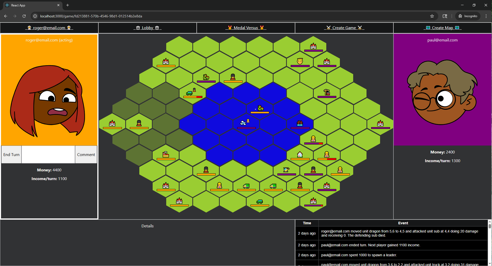

# TBS

TBS is a turn-based strategy game for the browser. The working title is "Medal Versus", which is meant to be a play on "MetaVerse" - the defunct facebook VR endeavor. 

This project uses:

- react
- s3 (todo)
- cloudfront (todo)

to run the /ui workspace, and 

- ec2 (todo)
- node.js
- dynamodb

to run the /server workspace. 

Other key dependencies:

- typescript (everywhere)
- eslint (everywhere)
- react router dom (UI routing)
- cloudscape (UI components)
- express (server)
- websocket.io (server)
- docker-desktop (to run a local version of dynamodb)
- dynamodb-admin (for dynamoDB GUI operations)
- npm workspaces (for sharing the "common" code within this monorepo)

## UI

The Front-end repository workspace is located under the directory "ui".
This directory was created using the "create react app" typescript template.

## Server

The Back-end repository is located in the directory "server".
It contains the dynamodb-local docker image in /dynamodb-local.
It also contains scripts for creating, deleting, and maintaining the database.
Most importantly, it contains the express server.

## Common
the logic to validate moves in the client is the same as the server. Types are also shared. If I were smarter, I might have named this "core", or even designed it as a "game engine"
instead of a loosey-goosey mish-mash of functions and types. However, the idea holds true that everything is "common" logic, without external dependencies, which are consumed by server and ui via npm workspaces. And so it is named "Common".

The most important thing to know is that the root package (/TBS) build command should be used to build everything in order - common first, then the server, then the UI (though the order between server and UI doesn't matter - the key point is that common should be built first in order to be consumed, and the build command in the project root will run all 3 in order).

## Local Development Setup
1. Install [docker desktop](https://docs.docker.com/desktop/)  and Node.js + NPM using [Node Version Manager](https://www.nvmnode.com/).
2. run `npm install` from the root of the project - this project follows a "monorepo" structure so that there is a single shared "node_modules" directory across the 3 workspaces, rather than each workspace having its own installation and "node_modules" directory. It is important to never run `npm install` from any of the individual workspaces.
3. run `./server/dynamodb-local/start.cmd` to deploy dynamodb-local to docker desktop. You do need to make sure docker desktop is running before using this command. You only need to use this command once. Afterwards, you can stop and start the service within docker-desktop's GUI. Once running, The local instance of dynamodb will be available at localhost:8000. 
4. Build the project workspaces in order with command `npm run build`. This will compile all the typescript (common first, then server, then UI). Note that all remaining commands are scripts found in the root package.json, which targets the server and ui workspaces via npm workspaces.
5. Create the dynamodb table using the npm script "db:create" - `npm run db:create`.  The resulting table uses the name "MedalVersus".
6. Start the game server using `npm run dev:server`. The server runs on localhost:8420.
7. Start the ui using `npm run dev:ui`. The react app runs on localhost:3000.
8. At this point, all requirements for local development are running. Howeer, if you ever need to inspect the database contents, it is helpful to use the "dynamodb-admin" tool, which provides a GUI for dynamodb. Simply run `dynamodb-admin` and then navigate to localhost:8001 to inspect and manage your table and its records.

## Ports Reference
- 3000 - UI
- 8000 - dynamodb-local
- 8001 - dynamodb-admin GUI
- 8420 - backend server